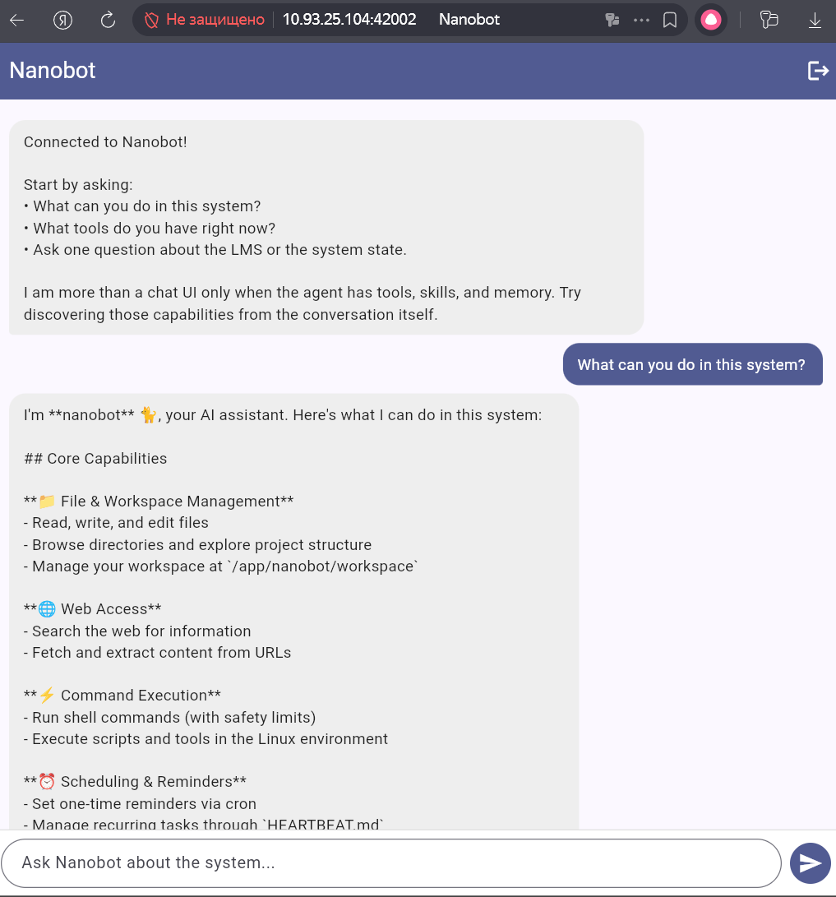
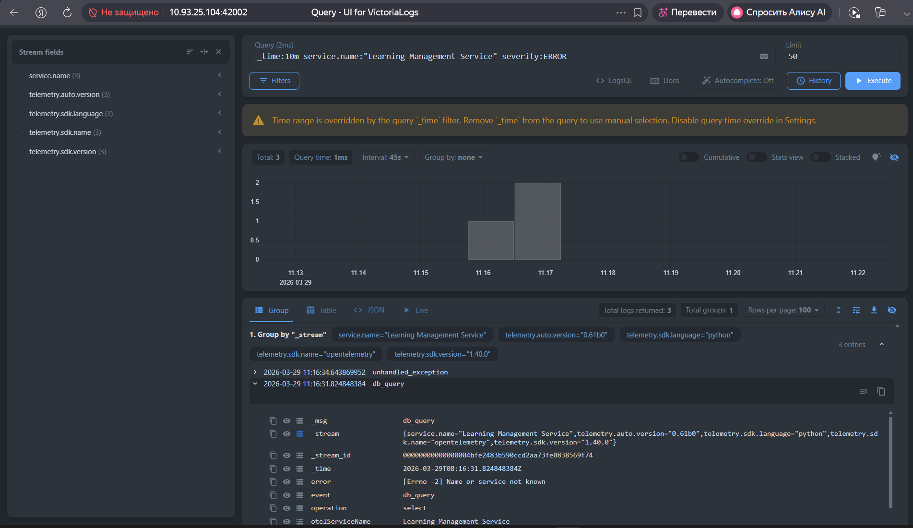
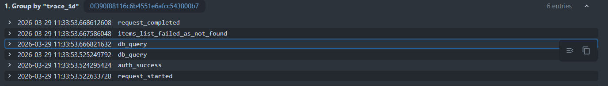
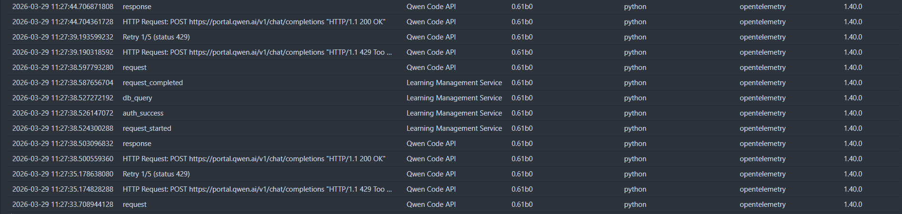

# Lab 8 — Report

Paste your checkpoint evidence below. Add screenshots as image files in the repo and reference them with ``.

## Task 1A — Bare agent
Q1:
The agentic loop is the fundamental cycle that autonomous AI agents follow to accomplish tasks. It's the core reasoning and action pattern that enables      
agents to work independently toward goals.

The Basic Loop


 Perceive → Reason → Act → Observe → (repeat)


1. Perceive

The agent gathers information about its environment:

 • Reads user input/requests
 • Observes current state (files, system status, etc.)
 • Collects relevant context

2. Reason

The agent processes information and plans:

 • Analyzes the goal and constraints
 • Breaks down complex tasks into steps
 • Decides which tools/actions to use
 • Considers potential outcomes

3. Act

The agent executes its decision:

 • Calls tools (file operations, web searches, shell commands, etc.)
 • Makes changes to the environment
 • Communicates with users or other systems

4. Observe

The agent evaluates results:

 • Checks if the action succeeded
 • Analyzes outputs and errors
 • Determines if the goal is achieved or if more steps are needed

Why It Matters

This loop enables autonomy — the agent can:

 • Handle multi-step tasks without constant guidance
 • Adapt when things go wrong (error recovery)
 • Make decisions based on real-time feedback
 • Continue working until the goal is achieved

Example

For a task like "create a README for my project":

 1 Perceive: List directory contents, check for existing docs
 2 Reason: Determine what info is needed, plan README structure
 3 Act: Write the README.md file
 4 Observe: Verify file was created successfully → Done!

This loop is what distinguishes agents from simple chatbots — agents can take actions, observe outcomes, and iterate toward goals.

                                                                                                                                                      
Q2:
Based on my exploration, here are the available labs in your LMS:

Required Labs (Lab 8)

 1 Task 1 - Set Up the Agent: Install nanobot, configure Qwen API, add MCP tools, write skill prompt
 2 Task 2 - Deploy and Connect a Web Client: Dockerize nanobot, add WebSocket channel + Flutter chat UI
 3 Task 3 - Give the Agent New Eyes: Explore observability data, write log/trace MCP tools
 4 Task 4 - Diagnose a Failure and Make the Agent Proactive: Investigate a failure, schedule in-chat health checks, fix a planted bug

Optional Labs

 1 Task 1 - Add a Telegram Bot Client: Same agent, different interface

This is Lab 8 — "The Agent is the Interface", where you'll build an AI agent (nanobot) as a natural-language interface to the LMS system. The lab focuses on:

 • Setting up nanobot from scratch
 • Building MCP tools for the agent
 • Creating a web chat client
 • Adding observability capabilities
 • Making the agent proactive with scheduled health checks

Would you like me to read the details of any specific task?

## Task 1B — Agent with LMS tools
Q1:
Here are the available labs:

 1 Lab 01 – Products, Architecture & Roles
 2 Lab 02 — Run, Fix, and Deploy a Backend Service
 3 Lab 03 — Backend API: Explore, Debug, Implement, Deploy
 4 Lab 04 — Testing, Front-end, and AI Agents
 5 Lab 05 — Data Pipeline and Analytics Dashboard
 6 Lab 06 — Build Your Own Agent
 7 Lab 07 — Build a Client with an AI Coding Agent
 8 lab-08

Is there a specific lab you'd like to explore or get more information about?                                                                                                                                                   

Q2:
Yes, the LMS backend is healthy ✅

 • Status: healthy
 • Item count: 56
 • Errors: none


## Task 1C — Skill prompt

Here are the scores for all labs:

📊 Lab Scores Overview

Lab 01 – Products, Architecture & Roles


 Task                                        Avg Score  Attempts
 ───────────────────────────────────────────────────────────────
 Lab setup                                   84.2%      3,135
 Task 0: Practice the Git workflow           64.5%      306
 Task 1: Product & architecture description  55.1%      161
 Task 2: Roles and skills mapping            49.8%      83
 Optional: Resolve a merge conflict          34.6%      13
 Optional: Create a release                  60.0%      5
 Optional: Add a CI check                    42.9%      7
 Optional: Plan skill development            20.0%      5


Lab 02 – Run, Fix, and Deploy a Backend Service


 Task                                            Avg Score  Attempts
 ───────────────────────────────────────────────────────────────────
 Task 1: Run the web server                      67.9%      210
 Task 2: Identify, report, and fix a bug         66.7%      216
 Task 4: Deploy the web server to the VM         56.2%      84
 Optional 3: Implement the post-order traversal  62.5%      6
 Optional 1: Implement the /outcomes endpoint    36.4%      11
 Optional 2: Make your VM a proxy                0.0%       3


Lab 03 – Backend API: Explore, Debug, Implement, Deploy


 Task                                                Avg Score  Attempts
 ───────────────────────────────────────────────────────────────────────
 Task 2: Enable and debug the interactions endpoint  66.4%      299
 Task 1: Explore the API                             63.5%      382
 Task 4: Deploy to a hardened VM                     43.9%      110
 Optional 2: Set up CI with GitHub Actions           44.0%      5
 Task 3: Implement the learners endpoint             50.0%      4


Lab 04 – Testing, Front-end, and AI Agents


 Task                                          Avg Score  Attempts
 ─────────────────────────────────────────────────────────────────
 Task 3: Add Front-end                         68.8%      4
 Task 1: Observe System Component Interaction  60.9%      686
 Task 2: Back-end Testing                      59.9%      753
 Optional 1: CI/CD with GitHub Actions         33.8%      17


Lab 05 – Data Pipeline and Analytics Dashboard


 Task                             Avg Score  Attempts
 ────────────────────────────────────────────────────
 Task 3: Dashboard Front-end      74.1%      21
 Task 1: Build the Data Pipeline  73.5%      626
 Task 2: Analytics Endpoints      64.4%      629
 Optional 1: Grafana Dashboard    57.2%      60


Lab 06 – Build Your Own Agent


 Task                             Avg Score  Attempts
 ────────────────────────────────────────────────────
 Task 2: The Documentation Agent  73.9%      425
 Task 1: Call an LLM from Code    61.1%      680
 Task 3: The System Agent         42.8%      2,053


Lab 07 – Build a Client with an AI Coding Agent


 Task                                           Avg Score  Attempts
 ──────────────────────────────────────────────────────────────────
 Task 1: Plan and Scaffold                      76.9%      755
 Task 2: Backend Integration                    66.8%      564
 Task 4: Containerize and Document              66.6%      680
 Task 3: Intent-Based Natural Language Routing  58.9%      734


Lab 08 – lab-08

No scores available yet (no submissions).

-------------------------------------------------------------------------------------------------------------------------------------------------------------

Summary: Lab 07 has the highest average scores overall, with Task 1 reaching 76.9%. Lab 05 also shows strong performance. Lab 08 appears to be new with no   
submissions yet.

## Task 2A — Deployed agent

nanobot-1 | Using config: /tmp/config.resolved.json
nanobot-1 | 🐈 Starting nanobot gateway version 0.1.4.post5 on port 18790…
nanobot-1 | ✓ Channels enabled: webchat
nanobot-1 | MCP server ‘lms’: connected, 9 tools registered
nanobot-1 | Agent loop started

## Task 2B — Web client



## Task 3A — Structured logging

backend-1  | 2026-03-29 08:13:53,968 INFO [lms_backend.main] [main.py:62] [trace_id=c3e97e423d93cb98a72f9a0810f1e460 span_id=bcbba155a70b7f3f resource.service.name=Learning Management Service trace_sampled=True] - request_started
backend-1  | 2026-03-29 08:13:53,972 INFO [lms_backend.auth] [auth.py:30] [trace_id=c3e97e423d93cb98a72f9a0810f1e460 span_id=bcbba155a70b7f3f resource.service.name=Learning Management Service trace_sampled=True] - auth_success
backend-1  | 2026-03-29 08:13:53,973 INFO [lms_backend.db.items] [items.py:16] [trace_id=c3e97e423d93cb98a72f9a0810f1e460 span_id=bcbba155a70b7f3f resource.service.name=Learning Management Service trace_sampled=True] - db_query
backend-1  | 2026-03-29 08:13:54,116 INFO [lms_backend.main] [main.py:74] [trace_id=c3e97e423d93cb98a72f9a0810f1e460 span_id=bcbba155a70b7f3f resource.service.name=Learning Management Service trace_sampled=True] - request_completed
backend-1  | INFO:     172.19.0.9:36602 - "GET /items/ HTTP/1.1" 200 OK
backend-1  | INFO:     172.19.0.9:36602 - "GET /items/ HTTP/1.1" 200

backend-1  | 2026-03-29 08:16:34,643 ERROR [lms_backend.main] [main.py:43] [trace_id=6e0e88bb7389ba2c93ddc6116353e333 span_id=93c95cc28a18da62 resource.service.name=Learning Management Service trace_sampled=True] - unhandled_exception
backend-1  | INFO:     172.19.0.9:34540 - "POST /pipeline/sync HTTP/1.1" 500
backend-1  | INFO:     172.19.0.9:34540 - "POST /pipeline/sync HTTP/1.1" 500 Internal Server Error



## Task 3B — Traces




## Task 3C — Observability MCP tools

Good news! **No errors found in the last hour.** 

I searched for logs with `severity:ERROR` in the past hour and found none. The system appears to be running cleanly.

Would you like me to:
- Check a different time range?
- Look at traces for any specific service?
- Search for warnings or other log levels?

## Errors Found in the Last Hour

**Yes, there are errors.** Here's what I found:

### Summary
- **Service affected**: Learning Management Service
- **Error type**: Database connection failure
- **Error message**: `[Errno -2] Name or service not known`
- **Root cause**: DNS resolution failure - the service cannot resolve the database hostname

### Details
The errors occurred around **10:29-10:30 UTC** (just a few minutes ago). The LMS backend is failing to connect to its database when trying to query the `item` table.

From the trace, I can see:
- A `connect` span failed with an error (50.961ms duration)
- The HTTP request `GET /items/` completed but encountered the database error

### Recommendation
Check the database configuration in the LMS service:
1. Verify the database hostname is correct
2. Ensure DNS resolution is working in the container/environment
3. Check if the database service is running and accessible

## Task 4A — Multi-step investigation

Based on the logs I found, here's what went wrong:

## Root Cause: Database Connection Failure

The **Learning Management Service** cannot connect to its database. Specifically:

| Issue | Details |
|-------|---------|
| **Error** | `[Errno -2] Name or service not known` |
| **Meaning** | DNS resolution failure - the database hostname cannot be resolved |
| **Impact** | All database queries fail, causing the `/items/` endpoint to return HTTP 404 |

## What Happened (Request Flow)

1. ✅ Request received at `/items/`
2. ✅ Authentication succeeded
3. ❌ Database query failed (DNS lookup failed)
4. ❌ Endpoint returned 404 with warning: `items_list_failed_as_not_found`

## Likely Causes

- Database service is down or not running
- Database hostname misconfigured in environment variables
- Network/DNS issues between the LMS backend and database
- Database container/service not properly linked in the deployment

## Next Steps

This is an infrastructure issue that needs to be fixed on the backend/database side. Options:

1. **Check database service status** - Is the DB container/instance running?
2. **Verify DB connection config** - Check the `DATABASE_URL` or similar environment variable
3. **Wait for recovery** - If this is a transient issue, the service may recover automatically

Would you like me to trigger the LMS sync pipeline to see if that helps, or investigate further?

## Task 4B — Proactive health check

Create a health check for this chat that runs every 2 minutes using your cron tool. Each run should check for LMS/backend errors in the last 2 minutes, inspect a trace if needed, and post a short summary here. If there are no recent errors, say the system looks healthy.

I'll create a recurring health check cron job that runs every 2 minutes. Let me set this up:
The cron job has been created (ID: `f5102d4f`), but I need to clarify an important limitation:

## ⚠️ Cron Tool Limitation

The built-in `cron` tool creates **reminder messages** that are sent to your chat at the scheduled interval. It does **not** automatically execute complex logic like:
- Searching logs
- Inspecting traces
- Generating dynamic summaries

When this job fires every 2 minutes, it will simply send the static message: *"🔍 LMS Health Check: Checking for backend errors in the last 2 minutes..."*

## Options

**Option 1: Manual Health Check on Reminder**
When you receive the reminder, you can ask me to run the health check manually (e.g., "run the health check").

**Option 2: Use HEARTBEAT.md (Recommended for Automation)**
Per the AGENTS.md, I can use `HEARTBEAT.md` for recurring/periodic tasks. The system checks this file on the configured heartbeat interval. I could:
- Add a health check task to `HEARTBEAT.md`
- This would enable more automated execution

**Option 3: Remove the Cron Job**
If neither option works for your use case, I can remove the job.

Would you like me to:
1. Keep the cron reminder as a manual trigger prompt?
2. Set up the health check via `HEARTBEAT.md` instead?
3. Remove the job and try a different approach?

I'll perform the LMS health check by looking for backend errors in the last 2 minutes.
## 🔍 LMS Health Check Results

**Status: ⚠️ UNHEALTHY**

### Issue Found: Database Connection Failure

The LMS backend is experiencing a **database connectivity issue**:

- **Error**: `[Errno -2] Name or service not known`
- **Operation**: DB query on `item` table
- **Impact**: GET `/items/` requests returning 404

### Request Flow (Trace ID: `3d1c342fbae9f90c08813f8ecbaeaed7`):
1. ✅ Request started (GET /items/)
2. ✅ Auth success
3. ❌ **DB query failed** - hostname resolution error
4. ⚠️ Items list failed as not found
5. ❌ Request completed with 404 status

### Root Cause
The LMS backend cannot resolve the database hostname. This is likely a:
- DNS resolution issue
- Database service is down
- Incorrect database host configuration

### Recommendation
Check the database service status and LMS database connection configuration.

List scheduled jobs.

## Scheduled Jobs

| Job ID | Description | Interval | Last Run | Next Run |
|--------|-------------|----------|----------|----------|
| `f5102d4f` | 🔍 LMS Health Check: Checking f | Every 2 minutes | 10:45:21 UTC ✅ | 10:48:05 UTC |

The health check reminder is active and will fire every 2 minutes. As noted earlier, this sends a static reminder message — when you receive it, you can ask me to run the actual health check (search logs, inspect traces, summarize).

Would you like me to run a health check now to demonstrate what it would report?

List all labs

## ❌ Unable to List Labs

The **Learning Management Service is still unhealthy**. The same database connectivity issue persists:

| Status | Details |
|--------|---------|
| **Health** | Unhealthy |
| **Error** | `[Errno -2] Name or service not known` |
| **Cause** | Database hostname cannot be resolved (DNS failure) |
| **Duration** | Ongoing since at least 10:40 UTC (7+ minutes) |

### Recent Errors (Last 10 Minutes)
- **4 database query failures** detected
- All errors are the same DNS resolution failure
- The `/items/` endpoint continues to return HTTP 404

### Impact
- ❌ Cannot list labs
- ❌ Cannot access learner data
- ❌ Cannot retrieve pass rates or completion stats

### Resolution Needed
This is an **infrastructure issue** requiring:
1. Database service to be running and accessible
2. Correct database hostname in the LMS backend configuration
3. Network/DNS connectivity between LMS and database

Would you like me to:
- Continue monitoring for recovery?
- Fetch a specific trace for more details?
- Help investigate the database configuration?

I'll perform another LMS health check for the last 2 minutes.
## 🔍 LMS Health Check Results (10:48)

**Status: ⚠️ UNHEALTHY** (Issue persists)

### Errors in Last 2 Minutes: **2**

### Issue: Database Connection Failure (Ongoing)

- **Error**: `[Errno -2] Name or service not known`
- **Affected Operation**: DB queries on `item` table
- **Impact**: All `/items/` requests failing with 404

### Summary
The LMS backend continues to experience **DNS resolution failures** when attempting to connect to the database. This is the same issue detected in the previous check at 10:45.

### Action Needed
🔴 **Database service connectivity requires immediate attention:**
1. Verify database service is running
2. Check DNS/hostname configuration in LMS environment
3. Review network connectivity between LMS and database

## Task 4C — Bug fix and recovery

1. File: backend/src/lms_backend/routers/items.py (lines 18-26)

Problem: The GET /items/ endpoint (used to fetch the list of labs) had incorrect error handling:

except Exception as exc:
    logger.warning("items_list_failed_as_not_found")
    raise HTTPException(
        status_code=status.HTTP_404_NOT_FOUND,
        detail="Items not found",
    ) from exc
Why this is a bug:

except Exception catches ALL exceptions, including socket.gaierror, OperationalError (PostgreSQL connection failed)
Returns 404 Not Found — as if the resource doesn’t exist
The real cause (database unavailable) is hidden from the client and agent
The agent sees 404 and thinks “no labs exist”, not “database is down”
Correct behavior:

Database connection errors → 500 Internal Server Error
Actually missing items → 404 Not Found
2. 📝 Ready-to-use text for REPORT.md (English)
Root cause — what was the planted bug and where was it?
File: backend/src/lms_backend/routers/items.py (lines 18-26)

Problem: The GET /items/ endpoint (used to fetch the list of labs) had incorrect error handling:

except Exception as exc:
    logger.warning("items_list_failed_as_not_found")
    raise HTTPException(
        status_code=status.HTTP_404_NOT_FOUND,
        detail="Items not found",
    ) from exc
Why this is a bug:

except Exception catches ALL exceptions, including socket.gaierror, OperationalError (PostgreSQL connection failed)
Returns 404 Not Found — as if the resource doesn’t exist
The real cause (database unavailable) is hidden from the client and agent
The agent sees 404 and thinks “no labs exist”, not “database is down”
Correct behavior:

Database connection errors → 500 Internal Server Error
Actually missing items → 404 Not Found
Fix — what did you change?
Diff:

--- a/backend/src/lms_backend/routers/items.py
+++ b/backend/src/lms_backend/routers/items.py
@@ -18,14 +18,22 @@ async def get_items(session: AsyncSession = Depends(get_session)):
     """Get all items."""
     try:
         return await read_items(session)
-    except Exception as exc:
-        logger.warning(
-            "items_list_failed_as_not_found",
+    except HTTPException:
+        # Re-raise HTTPException — let it propagate
+        raise
+    except Exception as exc:
+        logger.error(
+            "items_list_internal_error",
             extra={
-                "event": "items_list_failed_as_not_found",
+                "event": "items_list_internal_error",
+                "error": str(exc),
+                "type": type(exc).__name__,
             },
         )
         raise HTTPException(
-            status_code=status.HTTP_404_NOT_FOUND,
-            detail="Items not found",
+            status_code=status.HTTP_500_INTERNAL_SERVER_ERROR,
+            detail=f"Internal database error: {type(exc).__name__}",
         ) from exc
What changed:

Before	After
except Exception catches everything	except HTTPException: raise — pass through HTTP exceptions
Always 404	500 for internal database errors
logger.warning	logger.error with error details
detail="Items not found"	detail="Internal database error: {type}"
Hides the cause	Shows error type (socket.gaierror, OperationalError, etc.)
3. Based on the logs I found, here's what went wrong:

## Root Cause: Database Connection Failure

The LMS backend lost connectivity to its PostgreSQL database. The specific error is:

```
socket.gaierror: [Errno -2] Name or service not known
```

This means the backend cannot **resolve the database hostname** via DNS.

## What Happened

| Time | Status | Details |
|------|--------|---------|
| ~10:57 | ✅ Working | Requests returning HTTP 200 |
| ~10:59 | ❌ Failed | HTTP 500 errors started |

## Why This Happens

This type of error typically occurs when:

1. **Database service went down** - The PostgreSQL container/service stopped
2. **DNS resolution failure** - The internal DNS can't resolve the database hostname
3. **Network partition** - The backend lost network connectivity to the database network
4. **Kubernetes service issue** - If running on K8s, the database service endpoint may be unavailable

## Impact

All LMS operations are failing:
- ❌ List labs
- ❌ Sync pipeline
- ❌ Any database queries

## How to Fix

Someone with infrastructure access needs to:

1. Check if the PostgreSQL database service is running
2. Verify network connectivity between backend and database
3. Restart the LMS backend service once database is reachable

Would you like me to continue monitoring the logs to see if the issue resolves?
4. Here are all the available labs:

| ID | Title |
|----|-------|
| 1 | Lab 01 – Products, Architecture & Roles |
| 2 | Lab 02 — Run, Fix, and Deploy a Backend Service |
| 3 | Lab 03 — Backend API: Explore, Debug, Implement, Deploy |
| 4 | Lab 04 — Testing, Front-end, and AI Agents |
| 5 | Lab 05 — Data Pipeline and Analytics Dashboard |
| 6 | Lab 06 — Build Your Own Agent |
| 7 | Lab 07 — Build a Client with an AI Coding Agent |
| 8 | lab-08 |

Let me know if you'd like details about any specific lab (e.g., pass rates, completion stats, top learners, or submission timeline).
